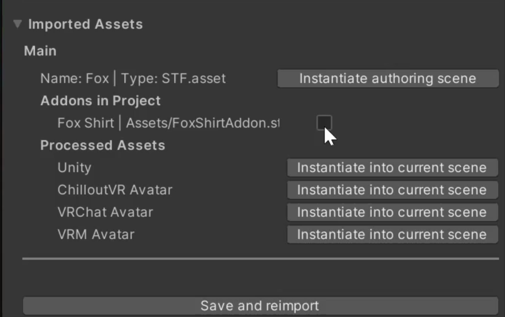

# STF Format
The STF format is similar to GLTF 2.0, but differs in significant ways.

It is a binary format made up of at least one chunk, which is always a UTF-8 encoded definition in the Json format. All further chunks are optional buffers which have to be referenced by the Json definition.

Every object in the Json Definition is addressed by UUID. It must persist between import and export.

Every object has a type. The importer/exporter for each object is selected by its type. Support for additional types can be hot-loaded.
If a type is not supported, the Json and all referenced objects have to be preserved and re-exported unless manually removed.

An STF file must stay the same between import and export, unless explicitly modified by the user.

## Table of Content
- [JSON Definition](#json-definition)
- [STF-Unity Specific Notes](#stf-unity-specific-notes)
- [Extensibility](#extensibility)
- [Addons](#addons)
- [Material Format](#material-format)
- [Current Status and Considerations](#current-status-and-considerations)
- [Some Background and Motivation](#some-background-and-motivation)
- [GLTF 2.0 Issues](#gltf-20-issues)

## JSON Definition
The JSON definition consists of 6 properties in the root object.
- `meta` Information about the file.
- `main` UUID of the main asset.
- `assets` A dict of UUID → asset pairs. Assets can list node UUID's and resource UUID's, depending on the asset type.
- `nodes` A dict of UUID → node pairs. Nodes can have a list of components and child-node UUID's. Specific node types can reference resources, other nodes and assets. (assets for example for a prefab instance, alternatively these could be done as components)
	- `components` A node's components describe additional information and behavior. For example mesh-instances or rotation constraints. Components can reference other nodes, resources and assets.
- `resources` A list of UUID → resource pairs. Resources can be referenced by nodes, components and assets. Resources can reference nodes, other resources and buffers. A resource's importer/exporter is responsible for dealing with any referenced buffer.
	- `components` A resource's components describe additional information and behavior. For example humanoid definitions for armatures or LOD's for meshes.
- `buffers` A list of buffer UUID's in the order of the binary chunks. The index of the buffer UUID corresponds to the index of the buffer in the STF file + 1. (The JSON definition is at the first index)

Example:

	{
		"meta": {
			"generator" : "stf-unity"
		},
		"main": "dc96ec16-17c2-4ac2-bd27-21f4c9a34bba",
		"assets": {
			"dc96ec16-17c2-4ac2-bd27-21f4c9a34bba": {
				"name": "Test",
				"type": "STF.asset",
				"root": "4147da6b-e4ca-42db-826e-46a5dda9322f",
				"author": "Emperor of Mars",
				...
			}
		},
		"nodes": {
			"4147da6b-e4ca-42db-826e-46a5dda9322f": {
				"name": "Super Awesome Model",
				"type": "STF.node",
				"trs": [...]
				"children": [
					"4147da6b-e4ca-42db-826e-46a5dda9322f",
					"300799c5-0941-471f-b7a0-7cf17dcd1f10"
				]
			},
			"4147da6b-e4ca-42db-826e-46a5dda9322f": {
				"name": "armature"
				"type": "STF.armature_instance",
				"armature": "eb563e89-1e7c-40de-8c52-8a14e252f400",
				"children": [...]
			},
			"300799c5-0941-471f-b7a0-7cf17dcd1f10": {
				"name": "Super Awsome Mesh",
				"type": "STF.node",
				"components": {
					"beeed3cb-9a6f-45ac-b41b-5bdf8e773ed3": {
						"type": "STF.mesh_instance",
						"mesh": "c152e896-aba8-44d8-a810-724bc619abb1",
						"armature_instance": "4147da6b-e4ca-42db-826e-46a5dda9322f",
						"materials": [...],
						"morphtarget_values": [...]
					}
				}
			}
		},
		"resources": {
			"c152e896-aba8-44d8-a810-724bc619abb1": {
				"type": "STF.mesh",
				"buffer": "4812027a-671e-42a2-8e29-187b08e8ce93",
				...
			},
			"eb563e89-1e7c-40de-8c52-8a14e252f400": {
				"type": "STF.armature",
				...
			}
		},
		"buffers": [
			"4812027a-671e-42a2-8e29-187b08e8ce93"
		]
	}

<!--## STF-Unity Specific Notes
This implementation for Unity uses a two stage design. The first one parses an STF file into a Unity scene using its own components which represent the STF file 1:1 with no regard for Unity functionality. This is called the authoring scene, as it can be used to export STF files.

Multiple second stages can be registered to convert the intermediary authoring scene into an application-specific one. This step is destructive and throws information not relevant for the target application away, including all STF related meta-information, resolves all relationships between components and potentially applies optimizations.

Included is a basic second stage which converts into a pure Unity scene, and throws everything else away.
The intermediary format is intended for authoring STF files.-->

## Extensibility
The extensibility of the STF format is a first class feature. All implementations must provide an easy way to add and hot-load support for additional types.

By default, STF supports only a limited set of features which can be expected from a common 3d file-format. These include support for skinned meshes, armatures, animations, materials and textures.

Components can have defined relationships to other components and be specific to a target application.
Components can extend or override others.

For example, multiple Social VR applications support one or another library for bone physics. None of which are compatible with each other, but they generally work the same.
A generic STF-component for bone-physics can be convertible to all implemented applications formats, erring on the side of the resulting physics not flipping out in the application.
If there exists an application specific component, it can override the basic generic component. This way multiple mutually exclusive and application/game-engine specific features can be supported simultaneously.

**To extend STF with the ability to represent VR & V-Tubing avatars, the 'AVA' Proof of Concept extensions were created. This shows the potential and ease of extending STF and is included in this repository.**

## Addons

It is possible to create assets of the type `STF.addon`. These provide a list of nodes that can be of the types `STF.appendage_node` and `STF.patch_node`. They target the nodes of other assets and either parent themselves to the target (appendage) or add their child nodes and components to the target (patch).

That way it becomes trivial for a third party to create assets like a set of clothing for a base character model. The STF importer scans the Unity project for STF addons targeting the selected asset and presents the user with a simple checkbox to apply it.

<!--  -->

## Material Format
As part of creating this format, I created a universal material format, called: **MTF - Material Transfer Format**.
It's included in this Repository, but not dependent on STF. STF merely makes use of MTF.

Materials consist of a dictionary of properties. A set of universal properties will be defined and must be used in its specified manner. These include albedo, roughness, specular, glossiness, etc.

Each property has a list of objects, in order of priority. Each object has a type property and can be a float, integer, string, color, texture, texture channel, etc.

It is a list to account for the case in which not every implementation can understand every type of property. The first object which is understood by the implementation and target-material will be used.

Example: The first and most prioritized object could be a mathematical definition, which is only understood by a few specific applications. To make it work elsewhere, the second object could be a texture, rendered from the mathematical definition.

Properties, not specified by the MTF format, can be freely used. Properties can indicate to which target application/shader they belong and so can the entire material. The material can also have a set of hint properties, indicating whether it should be rendered in a cartoony or realistic style for example.

Converters for specific shaders can be implemented, otherwise properties can be converted based on Unity's material-property system.
The "targets" property indicates which converter is to be preferably used. If a converter or target shader is not present, a default will be chosen, or the user can specify an alternative shader.

Even if a perfect conversion is not possible, the hope is that at least the best possible conversion can happen. This will also ease the switching to a different target shader.

	...
	"resources": {
		"d2a3568f-0116-4f3d-866d-9ce420035de6": {
			"type": "STF.material",
			"name": "Body",
			"targets": {
				"unity3d": [
					".poiyomi/Poiyomi 8.1/Poiyomi Toon"
				],
				"godot4": [
					...
				]
			},
			"albedo": [
				{
					"type" : "texture",
					"texture" : "94899926-6827-4cd3-84f8-9dbeff553199"
				}
			],
			"roughness": [
				{
					"type": "texture_view",
					"texture": "70cb8395-5fc8-4eff-99d8-809a20439b11",
					"channel": 3
				},
				{
					"type": "scalar",
					"value": 0.67
				}
			],
			"audiolink_emission": [
				...
			],
			"fur_length": [
				...
			]
		},
		...
	},
	...

## Current Status and Considerations
- Create more addon applier classes. I.e. to merge meshes, copy blendshape values, ...
- Generally refine the entire user experience of using STF. Build better inspectors for components and resources.
- Implement Scene assets.
- Add support for instantiating assets, especially into Scene assets.

# Some Background and Motivation
VR Avatars are currently distributed as packages for game-engines, specifically for Unity. This is an issue as end-users have a hard time using professional tools. Additionally, Unity is not a character-editor by itself, it's a tool with which a character-editor application could be built.

I wanted to create a universal character-editor application, aimed at end users wishing to adapt their VR Avatar models, but without the technical knowledge to work in a game-engine.
Therefore, I needed a file format that this character-editor-application could parse.

Initially I wanted to create a format based on GLTF 2.0 to represent VR & V-Tubing avatars in a single file, agnostic of any target application, but with support for 100% of the features of each.

*VRM is a format also in the form of a GLTF extension, which also represents VR & V-Tubing avatars. It was created before social-VR was figured out to the extent it is now, and doesn't support most basic features that users today expect and require*

I didn't think it would be too complicated to create something better than VRM, however I encountered countless issues with the GLTF 2.0 specification itself as well as many of its implementations.
I wanted to avoid having to create my own format, but after 4 months of trying, I saw no way to make this work with glTF 2.0.

After 4 more months, I have created this STF format prototype and the AVA proof of concept set of extensions. STF puts extensibility first, and supports most of everything that GLTF does, and makes it trivial to implement anything beside that.
STF was created with consideration of how most authoring tools like Blender, Unity, Godot or Unreal Engine represent models and scenes. As such, most headaches from GLTF should have been solved here, hopefully.

# glTF 2.0 Issues
- Material references and morphtarget values sit on the mesh, not its instances.
  https://github.com/KhronosGroup/glTF/issues/1249
  https://github.com/KhronosGroup/glTF/issues/1036
- In GLTF everything is addressed by index. Indices are very likely to break between import and export. (If an extension is not supported by an application and gets stored as raw JSON, that references other objects by index, it will break. Addon assets like supported by STF would also break.)
- Limited animation support. Only transforms and morphtarget values (per mesh, not per mesh-instance) can be animated.
  The [KHR_animation_pointer](https://github.com/KhronosGroup/glTF/pull/2147) extension proposal would fix that partially.
- There is weirdness with multiple meshes sharing the same armature.
  https://github.com/KhronosGroup/glTF/issues/1285
- Morphtarget names are not supported by the specification. Sometimes these are stored on the 'extras' field of the mesh, sometimes on the first mesh primitive. The Blender GLTF implementation does the first, the UnityGLTF implementation does the latter.
- GLTF only supports specific hard-coded materials.
- The buffer system is overly complicated and a lot of implementations don't bother with it. As such blendshapes store values for every vertex, even if not included in the blendshape. Typical VR avatars have often multiple hundred blendshapes, which leads to comical file sizes.
- GLTF itself is supremely extensible, however to implement additional extensions in most GLTF libraries, they have to be forked and modified at the core. When a GLTF implementation has support for loading additional extensions, like the Godot 4 engine, it is accompanied by significant issues.

## Issues in glTF 2.0 implementations I've tried to work with
- Blender
	- The Blender implementation exports insanely large files.
  https://github.com/KhronosGroup/glTF-Blender-IO/issues/1346
  A file being 95% larger and consisting of 95% zeros in the case of my Fox VR Avatar Base (thanks to about 200 morphtargets) is just not acceptable.
- Godot
	- Godot also exports ridiculously large files like Blender.
	- glTF import and export scene handling: https://github.com/godotengine/godot-proposals/discussions/6588
	- glTF export exclusions: https://github.com/godotengine/godot-proposals/discussions/6587
	- ImporterMeshInstance3D metadata lost in glTF import process: https://github.com/godotengine/godot-proposals/discussions/6586
- Unity
	- Hardcoded extensions in both UnityGLTF and the new in-developement GLTFast implementation.

To fix most of the issues, breaking changes would be needed for the GLTF specification, and a significant rethinking on how to implement it.
Most of this has been known for a long time, and there has been no change, only a silent absence of general GLTF use, sadly.

My hope is that I was able to account for all issues with STF, and to create something that can be extended further to fit in any use case for a 3d file format, while being extremely easy to work with.