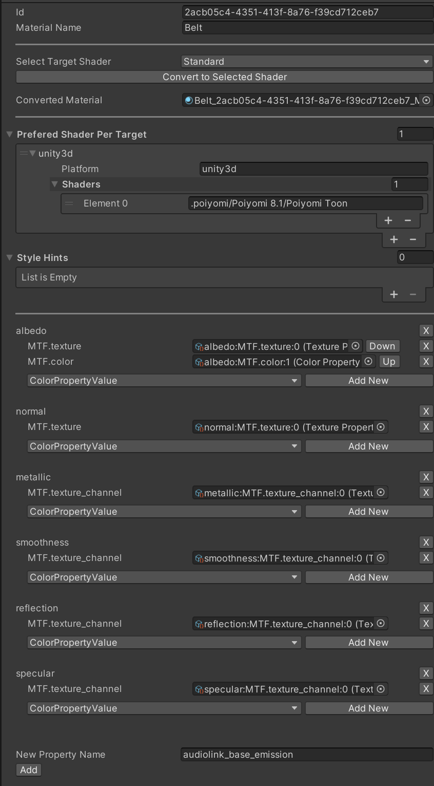

# MTF - Material Transfer Format [v0.3]
**An Shader & Game Engine Agnostic Material System**

Implementation for Unity 2022.3 or higher.

# **! This is a WIP and not ready for productive use !**

[Watch the video showcase (~1 minute)](https://youtu.be/VJUYrmEb-WQ?si=HTr7UoJRZlGc0YfE)

## Example MTF Material


## How
MTF Materials consist of a dictionary of properties. A set of universal properties will be defined and must be used in its specified manner. These include albedo, roughness, specular, glossiness, etc.

Each property has a list of property-values, in order of priority. Each property-value has a type property, which could be a float, integer, string, color, texture, texture channel, etc.
More property types can be implemented and hot-loaded.

It is a list, to account for the case in which not every implementation can understand every type of property-value. The first property-value, which is understood by the implementation and target-material, will be used.

Example: The first and most prioritized object could be a mathematical definition, which is only understood by a few specific applications. To make it work elsewhere, the second object could be a texture, rendered from the mathematical definition.

If a material is being imported which contains an unsupported property-value type, then the property-value type must be preserved. On export, the unsupported property type must be re-exported. STF provides this mechanism, it also preserves references/dependencies and ensures these are also re-exported.

Properties, not specified by the MTF format, can be freely used. Properties can indicate to which target application/shader they belong, and so can the entire material. The material can also have a set of hint properties, indicating whether it should be rendered in a cartoony or realistic style for example.

Converters for specific shaders can be implemented, otherwise properties can be converted based on Unity's material-property system.
The "targets" property indicates which converter is to be preferably used. If a converter or target shader is not present, a default will be chosen, or the user can specify an alternative shader.

Even if a perfect conversion is not possible, the hope is that at least the best possible conversion can happen. This will also ease the switching to a different target shader.


Example of how an MTF Material is serialized by STF:
```
"d2a3568f-0116-4f3d-866d-9ce420035de6": {
	"type": "MTF.material",
	"name": "Body",
	"targets": {
		"unity3d": [
			".poiyomi/Poiyomi 8.1/Poiyomi Toon"
		],
		"godot4": [
			...
		]
	},
	"albedo": [
		{
			"type" : "texture",
			"texture" : "94899926-6827-4cd3-84f8-9dbeff553199"
		}
	],
	"roughness": [
		{
			"type": "texture_view",
			"texture": "70cb8395-5fc8-4eff-99d8-809a20439b11",
			"channel": 3
		},
		{
			"type": "scalar",
			"value": 0.67
		}
	],
	"audiolink_emission": [
		...
	],
	"fur_length": [
		...
	]
}
```
