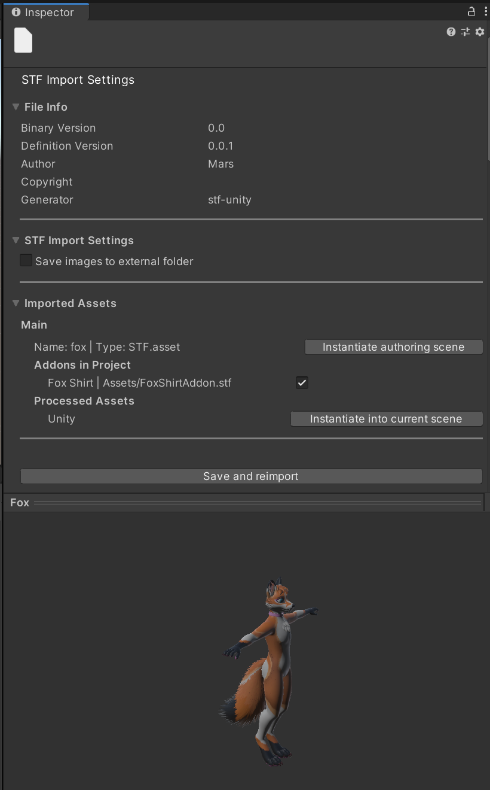

# STF - Scene Transfer Format
**The Worlds Most Extensible Fileformat for 3D Models and Scenes**

Implementation for Unity 2019.4 or higher.

# **!This is a prototype and not intended for productive use!**

You are very welcome to open discussions with your ideas, suggestions and questions about the format and its possibilities.

Open issues for concrete changes. Pull requests are very welcome!

## [Check out an example file here!](https://emperorofmars.itch.io/stf-avatar-showcase)
## [Watch the video presentation about STF and its AVA extensions here!](https://youtu.be/ozkmGxFG_ug)

## Table of Content
- [How to Use](#how-to-use)
- [STF Format](#stf-format)
- [Some Background and Motivation](#some-background-and-motivation)
	- [GLTF 2.0 Issues](#gltf-20-issues)

## How to Use
- Ensure you have the Newtonsoft JSON package imported in Unity. If you set up your Unity project with the VRC Creator Companion, it will be already imported. If not, install the official package in UPM.
- Either:
	- Download the latest release from this repository and import the .unitypackage into Unity.
	- Or clone this repository into the 'Assets' folder of your Unity project.
- Import a .fbx model, put it into the scene and export it as STF by going to `STF Tools` → `Export`
- If you exported it into the Assets hierarchy, just press CTRL+R for Unity to refresh its asset database and see it appear.
- Play around

## STF Format

[Read up on how STF works.](./Docs/stf_format.md)

## Some Background and Motivation
VR Avatars are currently distributed as packages for game-engines, specifically Unity. This is an issue as end users have a hard time using professional tools. Additionally, Unity is not a character-editor, it's a tool with which a character-editor application can be created.

I wanted to create a universal character-editor application aimed at end users wishing to adapt their VR Avatar models but without the technical knowledge to do so in a game-engine.
Therefore, I needed a file format that this character-editor-application could parse. This is where my descend into madness began.

Initially I wanted to create a format based on GLTF 2.0 to represent VR & V-Tubing avatars in a single file, agnostic of any target application, but with support for 100% of the features of each.

*VRM is a format also in the form of a GLTF extension, which also represents VR & V-Tubing avatars. However, it only supports a small subset of features, supports only a small number of hard-coded materials and doesn't support animations at all.*

I didn't think it would be too complicated to create something better than VRM, however I encountered countless issues with the GLTF 2.0 specification itself as well its implementations.
I wanted to avoid having to create my own format, but after 4 months of trying, I saw no way to make this work with GLTF 2.0.

After 4 more months, I have created this STF format prototype and the AVA proof of concept set of extensions. STF puts extensibility first, and supports most of everything that GLTF does, and makes it trivial to implement anything beside that.
STF was created with consideration of how most applications like Blender, Unity, Godot or Unreal Engine represent models and scenes. As such, most headaches from GLTF should have been solved here, hopefully.

### GLTF 2.0 Issues
- Material references and morphtarget values sit on the mesh, not its instances.
  https://github.com/KhronosGroup/glTF/issues/1249
  https://github.com/KhronosGroup/glTF/issues/1036
- In GLTF everything is addressed by index. Indices are very likely to break between import and export. (If an extension is not supported by an application and gets stored as raw JSON, that references other objects by index, it will break. Addon assets like supported by STF would also break.)
- Limited animation support. Only transforms and morphtarget values (per mesh, not per mesh-instance) can be animated.
  The [KHR_animation_pointer](https://github.com/KhronosGroup/glTF/pull/2147) extension proposal would fix that partially.
- There is weirdness with multiple meshes sharing the same armature.
  https://github.com/KhronosGroup/glTF/issues/1285
- Morphtarget names are not supported by the specification. Sometimes these are stored on the 'extras' field of the mesh, sometimes on the first mesh primitive. The Blender GLTF implementation does the first, the UnityGLTF implementation does the latter.
- GLTF itself is supremely extensible, however to implement additional extensions in most GLTF libraries, they have to be forked and modified at the core. When an GLTF implementation has support for loading additional extensions, like the Godot 4 engine, it is often accompanied by significant issues.
- GLTF only supports specific hard-coded materials.

#### Issues in implementations I've tried to work with
- Blender
	- The Blender implementation exports insanely large files.
  https://github.com/KhronosGroup/glTF-Blender-IO/issues/1346
  Godot does this as well.
  A file being 95% larger and consisting of 95% zeros in the case of my Fox VR Avatar Base (thanks to about 200 morphtargets) is just not serious.
- Godot
	- Godot also exports ridiculously large files like Blender.
	- glTF import and export scene handling: https://github.com/godotengine/godot-proposals/discussions/6588
	- glTF export exclusions: https://github.com/godotengine/godot-proposals/discussions/6587
	- ImporterMeshInstance3D metadata lost in glTF import process: https://github.com/godotengine/godot-proposals/discussions/6586
- Unity
	- Hardcoded extensions in both UnityGLTF and the new in developement GLTFast implementation.

To fix most of the issues, breaking changes would be needed for the GLTF specification.
Most of this has been known for a long time, and there has been no change, only a silent absence of general GLTF use, sadly.

My hope is that I was able to account for all issues with STF and create something that can be extended further to fit in any use case for a 3d file format, while being extremely easy to work with.

---

Cheers!
