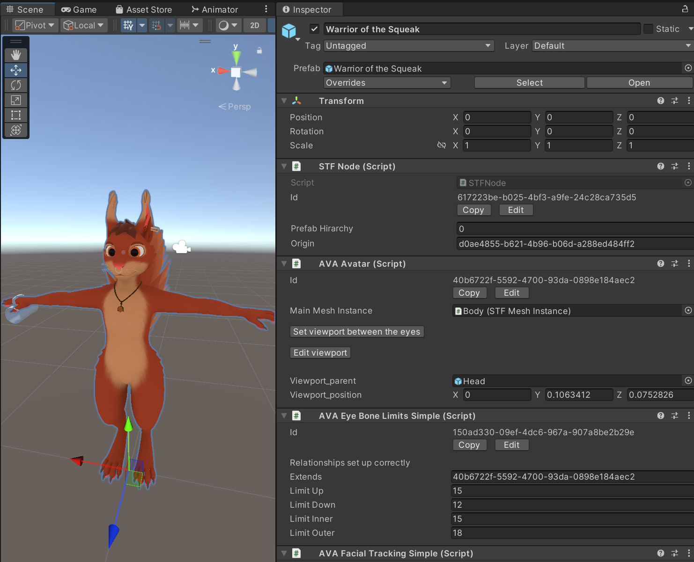

# STF - Scene Transfer Format [v0.2]
**Extensible Interchange Format for 3d Assets**

Implementation for Unity 2022.3 or higher.

# **! This is a WIP and not ready for productive use !**
[Find an example model here!](https://emperorofmars.itch.io/stf-avatar-showcase)

[Watch the video presentation!](https://www.youtube.com/watch?v=cgY-faQrv78)

## Introduction
I am in need of an open & extensible interchange format for 3d assets.

Unfortunately, such a format does not exist.

`fbx` is the next best thing, being the most widely supported and able to store the most of my models.
However, it is proprietary, undocumented and not extensible. Some open source implementations are unfortunately faulty. Blender for example won't export animation curves, baking animations instead and making them useless for further editing. The paid [Better Fbx Importer & Exporter](https://blendermarket.com/products/better-fbx-importer--exporter) addon for Blender does the job.

`glTF 2.0` was originally designed as a distribution format, intended to be easily loaded into GPU memory. Some projects are trying to use it as an authoring/interchange format. Apparently this is a matter of a somewhat active debate. After trying to work with glTF 2.0 in this manner and analyzing its spec I don't think it can work for interchange/authoring. [Read in detail why here!](./Docs/gltf_doesnt_work_as_an_interchange_format.md)

**My core requirements for an open & extensible 3d interchange format are:**
* Extensions must be hot loadable and trivial to implement, enabling rapid prototyping of extensions.
* Between import and export, the file can not change (except for some metadata perhaps). If an extension is not supported, it and all of its dependencies must be preserved and reexported, unless manually removed by the author.
* Everything must be addressed by a unique ID. This makes third party addons for a base model more robust for example.
* Materials must be arbitrary and shader agnostic.

## STF Format
STF is a binary format based on the concept of glTF 2.0, consisting of a definition in JSON and a bunch of binary buffers.

The JSON definition consists of 4 `UUID → object` dictionaries in the root object. All objects must contain a `type` property.
- `asset` Information about the file. Has to define one or more root-nodes, depending on the `type`. The default asset-type has a single root node.
- `nodes` An object of UUID → node pairs.
	- `components` A node's components describe additional information and behavior. For example mesh-instances or rotation constraints.
- `resources` An object of UUID → resource pairs.
	- `components` A resource's components describe additional information and behavior. For example humanoid-mappings for armatures or LOD's for meshes.
- `buffers` A list of buffer UUID's in the order of the binary chunks. The index of the buffer UUID corresponds to the index of the buffer in the STF file + 1. (The JSON definition is at the first index)

By default, only the basic types a 3d format has to support are included. These include for example meshes, armatures, images/textures, and a shader agnostic material.
Support for additional types can be easily hot-loaded.

### [Read up on how the STF Format works in more detail here.](./Docs/stf_format.md)

## How to Use
- Ensure you have the Newtonsoft JSON package imported in Unity. If you set up your Unity project with the VRC Creator Companion, it will be already imported. If not, install the official package in UPM.
- Either:
	- Download the latest release from this repository and import the `.unitypackage` into Unity.
	- Or clone this repository into the 'Assets' folder of your Unity project.
- Import a `.fbx` model, put it into the scene and export it as STF by going to `STF Tools` → `Export`.
- If you exported it into the Assets hierarchy, just press `CTRL+R` for Unity to refresh its asset database and see it appear.
- Play around!

# This Repository
Apart from the core STF format implementation, this repository contains a subproject called MTF, which adds support for arbitrary and shader-agnostic materials. It's independent of STF and could be further expanded into its own project.

Support for VR-Avatars is contained in the AVA directory. It's a proof-of-concept set of application-agnostic avatar components and converters for VRChat and VRM.

A good place to start exploring the codebase is [./STF/Runtime/STFRegistry.cs](./STF/Runtime/STFRegistry.cs), where types get registered, or [./STF/Runtime/Serialisation/ImportExport/STFFile.cs](./STF/Runtime/Serialisation/ImportExport/STFFile.cs) which handles the parsing and serialisation of binary STF files.

**You are very welcome to open discussions & issues with your ideas, suggestions and questions about the format and its possibilities. Pull requests are very welcome!**

# Original Motivation
I make avatars for VR. The by far most popular and relevant social VR application is VRChat. VR avatars can also be used for V-Tubing, rendering/filmmaking and various other applications.

The single relevant format for VR & V-Tubing avatars is a `.unitypackage` that contains a scene with a setup for a specific application, usually VRChat only, somewhere in its hierarchy.

There is no interoperability for avatars. Using those avatars as an end-user is prohibitively difficult as it requires the use of a Game-Engine like Unity.

STF should be able to easily host an extension for application agnostic & fully featured VR & V-Tubing avatars.

Once such a format exists, I hope a sort of 'Character Editor' application can be created. End-users would be able to adapt their avatars as easily as in a video-game character creation screen and easily use them in applications like VRChat and VSeeFace. Currently, there is not even a 3d asset interchange format that satisfies basic needs, so this lies in the far future.

# Current Status
* This codebase, as well as the format itself, are the result of a lot of experimentation.
* Most functionality which can be expected of a 3d model format is implemented, not to full production readiness, but enough to show how the format is supposed to work. The focus is to make the 'container' format work. Specific types can be perfected at a later date.
* The UI/UX of STF tooling is not a priority, but some work has been done to make it reasonable.
* The codebase is tested only in a 'good weather flight' manner.

Alone, I can't bring a project like this to completion, as I can work on this only in my free time, while also making VR avatars as a hobby.

**I alone can only try to prove that this works and is very possible.**

I am available for questions and discussions.

My next step is likely going to be a cleanup of the functionality, and then an implementation for the Godot 4 engine. Once Blender's project 'Baklava' is released (Support for full animations) I may implement STF also in Blender.

---

Cheers!
